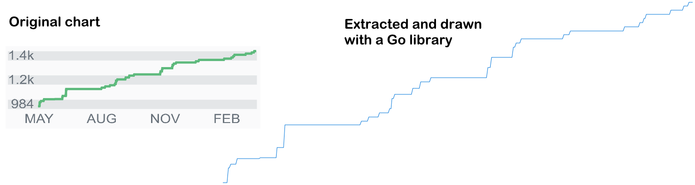

[](https://github.com/xarantolus/jsonextract/actions?query=workflow%3ATests) [](https://pkg.go.dev/github.com/xarantolus/jsonextract)
# jsonextract
`jsonextract` is a Go library for extracting JSON and JavaScript objects from any source. It can be used for data extraction tasks like web scraping.

If any text looks like a JavaScript object or is close looking like JSON, it will be converted to it.

### Examples
Here is an example program that extracts all JSON objects from a file and prints them to the console:

```go
package main

import (
	"fmt"
	"log"
	"os"

	"github.com/xarantolus/jsonextract"
)

func main() {
	file, err := os.Open("file.html")
	if err != nil {
		log.Fatalln(err.Error())
	}
	defer file.Close()

	// Print all JSON objects and arrays found in file.html
	err = jsonextract.Reader(file, func(b []byte) error {
		// Here you can parse the JSON data using a normal parser, e.g. from "encoding/json"
		// If you want to continue with the next object, return nil
		// To stop after this object, you can return jsonextract.ErrStop

		// len(b) > 0 will always be true

		// But here, we just print the data
		fmt.Println(string(b))

		return nil
	})
	if err != nil {
		log.Fatalln(err.Error())
	}
}
```

### Extractor program
There's a small extractor program that uses this library to get data from URLs and files.

If you want to give it a try, you can just go-get it:

    go get -u github.com/xarantolus/jsonextract/cmd/jsonx

You can use it on files or URLs, e.g. like this:

    jsonx reader_test.go

or on URLs like this:

    jsonx "https://stackoverflow.com/users/5728357/xarantolus?tab=topactivity"

### Other examples
There are also examples in the [`examples`](examples/) subdirectory.

The [string example](examples/string/main.go) shows how to use the package to quickly get all JSON objects/arrays in a string, it uses a [`strings.Reader`](https://pkg.go.dev/strings#NewReader) for that.

The [`stackoverflow-chart` example](examples/stackoverflow-chart/main.go) shows how to extract the reputation chart data of a StackOverflow user. Extracted data is then used to draw the same chart using Go:



### Supported notations
This software supports not just extracting normal JSON, but also other JavaScript notation.

This means that text like the following, which is definitely not valid JSON, can also be extracted to an object:

```js
{
	// Keys without quotes are valid in JavaScript, but not in JSON
	key: "value",
	num: 295.2,

	// Comments are removed while processing

	// Mixing normal and quoted keys is possible 
	"obj": {
		"quoted": 325,
		unquoted: 'test', // This trailing comma will be removed
	}
}
```

results in 

```json
{"key":"value","num":295.2,"obj":{"quoted":325,"unquoted":"test"}}
```


### Notes
* After passing the `io.Reader` to functions of this package, you should no longer use it afterwards. It might be read to the end, but in cases of stopping (using [`ErrStop`](https://pkg.go.dev/github.com/xarantolus/jsonextract#ErrStop)) some data might remain in the reader.
* When extracting objects from JavaScript files, you can end up with many arrays that look like `[0]`, `[1]`, `["i"]`, which is a result of indices being used in the script. You have to filter these out yourself.

### Changelog
* **v1.1.9**: JS Regex patterns are now returned as strings
* **v1.1.8**: Fix bug where template literals were interpreted the wrong way when certain escape sequences were present
* **v1.1.7**: More efficient extraction when a trailing comma is found
* **v1.1.6**: Always return the correct error
* **v1.1.5**: Small clarification on the callback
* **v1.1.4**: Support trailing commas in arrays and objects
* **v1.1.3**: Many small internal changes
* **v1.1.2**: Also support JS template strings
* **v1.1.1**: Also turn single-quoted strings into valid JSON
* **v1.1.0**: Now supports anything that *looks like* JSON, which also includes JavaScript object declarations
* **v1.0.0**: Initial version, supports only JSON

### [License](LICENSE)
This is free as in freedom software. Do whatever you like with it.
